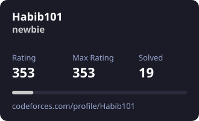

<h3>Learning • Solving • Building</h3>

<a href="https://codeforces.com/profile/Habib101">Codeforces</a> •
<a href="https://leetcode.com/u/habibprogrammerbd/">LeetCode</a> •
<a href="https://www.codechef.com/users/ahosan_habib">CodeChef</a> •
<a href="https://github.com/habibprogrammerbd">GitHub</a>

---

## 🚀 About Me

- 🎓 CSE Student based in **Rangpur, Bangladesh**
- 🔭 Solving **DSA problems on Codeforces & LeetCode**
- 🌱 Learning **Data Structures & Algorithms with C++**
- 🤝 Open to collaborate on **backend development & competitive programming projects**
- 📫 [habibprogrammerbd@gmail.com](mailto:habibprogrammerbd@gmail.com)
- 🌐 [Portfolio](https://my-portfolio-five-pearl-14.vercel.app/)

---

## 🛠️ Tech Stack

---

## 🏆 Competitive Programming

<table>
<tr>
<td align="center" width="33%">

<a href="https://codeforces.com/profile/Habib101">

  
<b>▣ CODEFORCES</b>
</a>

</td>

<td align="center" width="33%">

<a href="https://leetcode.com/u/habibprogrammerbd/">

  
<b>◆ LEETCODE</b>
</a>

</td>

<td align="center" width="33%">

<a href="https://www.codechef.com/users/ahosan_habib">
<h1>CC</h1>
<b>♟ CODECHEF</b>
</a>

</td>
</tr>
</table>

 

Codeforces & LeetCode avatars + stats auto-update daily via GitHub Actions (see <code>.github/workflows/update-avatars.yml</code>)

---

## 📊 GitHub Activity

<a href="https://github.com/habibprogrammerbd">
<b>View my GitHub profile, repositories, contributions and activity →</b>
</a>

---

## 🌐 Connect With Me

---

<a href="https://github.com/habibprogrammerbd">GitHub</a> •
<a href="https://codeforces.com/profile/Habib101">Codeforces</a> •
<a href="https://leetcode.com/u/habibprogrammerbd/">LeetCode</a> •
<a href="https://www.codechef.com/users/ahosan_habib">CodeChef</a>

